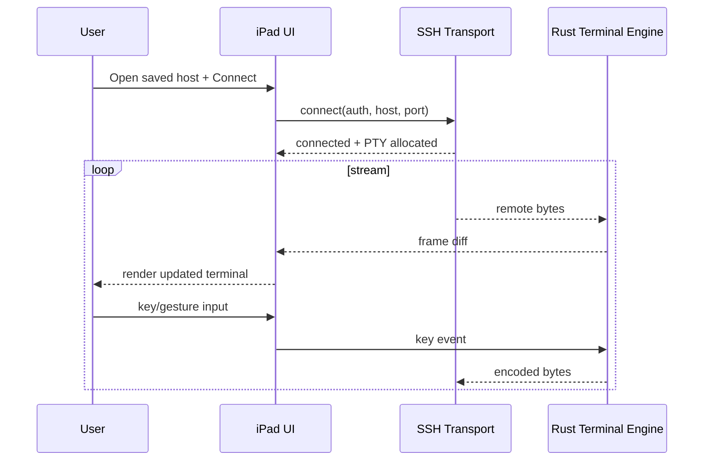

# ipad-ssh-client: Tech Spec — Warp terminal as an SSH client on iPad

## Context

Warp today is built around a desktop terminal architecture where a `TerminalView` owns UI interactions and a `TerminalModel` owns state transitions for terminal grids, blocks, and input/output parsing (`app/src/terminal`, `crates/warp_terminal`). The terminal core already supports ANSI parsing, keyboard protocol handling, and shell metadata extraction in a platform-agnostic Rust crate (`crates/warp_terminal/src/model`, `crates/warp_terminal/src/shell`).

There is also existing SSH-related behavior in settings (`app/src/settings/ssh.rs`, `app/src/settings/block_visibility.rs`), but no iOS runtime target or UIKit/SwiftUI integration in this repository today. That means an iPad SSH client is not a straightforward “compile for iOS” task; we need an explicit architecture split between:

1. **Portable terminal core** (Rust, no desktop UI assumptions)
2. **iPad-native UI shell** (Swift/SwiftUI + input system)
3. **SSH transport/runtime bridge** (mobile-safe process/network model)

Key constraints discovered from current code shape:

- The terminal emulator primitives are portable Rust and are the best reuse point.
- Desktop view/state orchestration is tightly coupled to Warp’s app framework and would not directly map to touch-first iPad UX.
- Local PTY spawning assumptions (desktop shell process model) do not hold on iPad; the MVP should center on **remote SSH sessions**, not local shell execution.

## Proposed changes

## Decision: SwiftUI vs React Native Expo

**Decision (revised): build React Native Expo first, with a native-module escape hatch.**

Why Expo-first for initial delivery:

1. **Fast iteration on connection UX:** host lists, auth forms, key import surfaces, and session management screens ship faster in React Native.
2. **Developer velocity:** we can prototype product loops quickly while terminal-core and SSH edges are still being validated.
3. **Cross-platform leverage:** the same app shell can be reused for future Android exploration with less rework.
4. **Controlled risk via native modules:** performance-critical terminal rendering/input and SSH byte streaming can move into custom native modules when needed.

Known downsides (and mitigations):

- **Potential input/rendering latency:** mitigate by keeping the terminal engine in Rust and minimizing JS-bridge chatter via coarse-grained frame diffs.
- **Keyboard fidelity limits in pure Expo APIs:** plan early for custom iOS native modules for advanced key handling.
- **SSH transport integration complexity:** use native module boundary for long-lived socket/stream handling rather than JS-only networking.

Implementation consequence:

- Build an **Expo-managed app first** for app shell and product flows.
- Introduce a **custom native module layer** (iOS-first) for:
  - Rust terminal engine bridge
  - low-latency terminal viewport updates
  - SSH transport/session streaming
- Re-evaluate full SwiftUI/native shell only if Expo + native modules cannot meet terminal fidelity targets in Phase 1.

### 1) Define product boundary for MVP: iPad as remote terminal only

MVP scope:

- Create/manage SSH connections (host/user/port/auth)
- Render remote shell output with Warp terminal core fidelity
- Send keyboard/input gestures to remote shell
- Basic session lifecycle (connect/reconnect/disconnect)

Out of MVP:

- Local shell execution on iPad
- Full parity with desktop block/AI workflows
- Plugin ecosystem / heavy desktop-only integrations

This boundary avoids platform dead-ends and aligns with iPad sandbox/runtime limits.

### 2) Extract a reusable terminal-engine API surface from existing Rust core

Create an internal crate layer (e.g. `crates/warp_terminal_engine`) that wraps `warp_terminal` primitives behind a stable FFI-friendly API:

- `TerminalEngine::new(config)`
- `ingest_bytes(&[u8])` (remote output)
- `send_key_event(KeyEvent)` → encoded bytes for transport
- `resize(cols, rows)`
- `snapshot()` / `diff_since(seq)` for efficient UI rendering

Implementation notes:

- Keep parser/grid state in Rust.
- Avoid exposing deep internal types over FFI; use serialized structs (C ABI safe) or generated bindings (`uniffi`/`cxx` decision in implementation phase).
- Treat this as an anti-corruption boundary so desktop refactors do not break mobile.

### 3) Build SSH transport adapter for iPad runtime

Introduce an abstraction:

- `trait RemoteTerminalTransport { connect, write, close, resize_pty }`

Desktop can continue existing behavior; iPad implementation uses an SSH library compatible with iOS distribution/compliance. Two practical paths:

- Rust-native transport in a new crate and bridged to iOS app.
- Swift transport (e.g. NMSSH/libssh2 wrapper) feeding bytes into Rust engine.

Recommendation: prefer Rust transport if we want shared reconnect/auth logic across platforms; prefer Swift transport if iOS integration velocity is primary.

### 4) React Native Expo app shell (new client target)

Create an Expo app target (outside current desktop app runtime) that:

- Hosts terminal viewport with virtualized rendering.
- Maps touch gestures + hardware keyboard events to terminal key events, using custom native modules for advanced keyboard behavior where Expo APIs fall short.
- Handles iPad-specific UX: text selection handles, software keyboard accessory row (Esc/Ctrl/Tab/arrows), split view, orientation changes.
- Integrates secure credential storage (Keychain/SecureStore) for SSH keys and known_hosts policy, with native modules for sensitive key workflows.

### 5) Session/state model tuned for mobile reliability

Add a mobile-first session manager:

- Connection state machine (`Idle -> Connecting -> Authenticated -> Streaming -> Suspended -> Reconnecting -> Closed`)
- Background/foreground lifecycle hooks
- Network reachability backoff
- Optional keepalive/ping policy

This should be separate from desktop pane/workspace lifecycle.

### 6) Security/compliance hardening

Required for iPad shipping:

- Host key verification UX and persistence
- Private key import + passphrase handling in secure enclave/Keychain-backed storage when possible
- Log redaction policy (never persist plaintext secrets)
- Crash/report pipelines scrubbed for command content unless user-opted

### 7) Rollout strategy

- **Phase 0 (Prototype):** Rust terminal engine bridged to an iOS test harness with mocked byte stream.
- **Phase 1 (Internal alpha):** Real SSH connect + render + input; no sync, no advanced desktop features.
- **Phase 2 (Beta):** Multi-session UX, reconnection polish, key management import flow.
- **Phase 3 (Public):** Stability hardening, analytics, support docs.

## End-to-end flow

## Testing and validation

1. **Terminal fidelity tests (Rust unit/integration):**
   - ANSI rendering parity snapshots against existing `warp_terminal` behavior.
   - Cursor movement, scrollback, wrap, and alternate-screen transitions.

2. **SSH transport tests:**
   - Auth matrix (password/key/passphrase-protected key).
   - Host-key mismatch and rotation flows.
   - PTY resize propagation under orientation changes.

3. **iPad UI tests:**
   - Hardware keyboard mappings (Esc/Ctrl/meta combos).
   - Software keyboard accessory controls.
   - Split-screen and rotation rendering correctness.

4. **Resilience tests:**
   - App background/foreground during active session.
   - Airplane mode/network handoff recovery.
   - Long-running remote command output soak tests.

5. **Manual dogfood checklist:**
   - SSH into Linux/macOS hosts, run `vim`, `tmux`, `top/htop`, and unicode-heavy output.
   - Validate copy/paste and selection under touch + keyboard.

## Risks and mitigations

- **Risk:** Over-coupling iPad with desktop view architecture slows delivery.
  - **Mitigation:** Keep mobile shell independent; share only Rust engine + protocol abstractions.

- **Risk:** FFI boundary churn as terminal internals evolve.
  - **Mitigation:** Introduce explicit stable engine API and versioning; avoid exposing internal structs.

- **Risk:** iPad keyboard/input edge cases reduce terminal usability.
  - **Mitigation:** Add dedicated keyboard conformance matrix early and test against common CLI apps.

- **Risk:** SSH security UX errors (host key trust, key import) create support burden.
  - **Mitigation:** Conservative defaults, explicit trust prompts, and robust keychain-backed storage.

## Parallelization

1. **Track A — Engine extraction:** Create FFI-safe terminal-engine crate and diff API.
2. **Track B — iOS shell:** Build viewport/input/session UI scaffolding against mocked stream.
3. **Track C — SSH transport:** Implement connection/auth/reconnect/host-key flows.
4. **Track D — Validation:** Build automated fidelity and lifecycle test matrix.

## Follow-ups

- Evaluate whether block metadata or AI overlays can be incrementally layered after SSH MVP.
- Decide long-term whether mobile should share account/session sync with desktop from day one or post-MVP.
